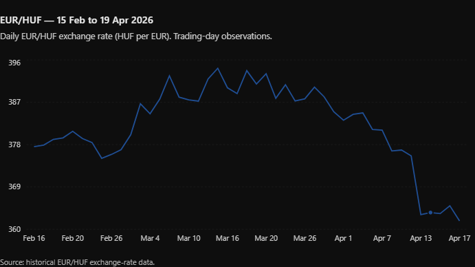

  <header class="post-hero">
    
Adam on FIRE · Blog

    <h1 class="post-title">{{ page.title | escape }}</h1>
    
{{ page.date | date: "%Y. %m. %d." }}

  </header>

  <article class="post-body">

<strong>141 SEATS! I could hardly believe it! What just happened?</strong>

For me, the past two weeks have been absolutely extraordinary. Let me start at the beginning: several foreign journalists contacted me for interviews about the Hungarian election. In the end, I spoke to a Danish, a Romanian, and a German journalist between April 4 and 13. What was interesting was that the closer we got to April 12, the more optimistic my comments became. On April 4 I was still saying that “we will probably see record turnout and a solid Tisza victory,” and by the 11th I was saying that “there is a real chance Tisza will win a two-thirds majority with turnout of 75–80%.” And lo and behold, that is exactly what happened. Nearly 3.4 million people said enough was enough — they wanted no more of Orbán.

What shocked me most was that Orbán simply congratulated Péter Magyar when 55% of the votes had been counted. There was no uproar, no blaming Ukraine — that was it, it was over. Unfortunately, I am certain things would not have gone this smoothly with a closer result. I was also struck by the joy in the streets; it suddenly became clear just how many hundreds of thousands of people had experienced this system as a prison. Since I started working, I had to spend 5,797 days of my life under this system. Admittedly, there was a five-year break while I lived in the UK, but even then I defined myself as a permanent opponent of Fidesz and the Orbán system. And now, for the first time in my life, the party I voted for actually won. It is a very strange feeling. I also feel that although 16 years were taken from us, there is still a chance for Hungary to move onto a better path and once again become a European, democratic — or at least more democratic — country.

Another funny moment came before the election, when I asked on Reddit: “How much do you think the forint will strengthen if Tisza wins?” I got plenty of replies saying, “it is already priced in.” Then suddenly: a 4% strengthening in a single week, and who knows how much further the forint can go. It really resembled what happened in Poland in autumn 2023: once the Polish far right lost and a new government came in, the zloty immediately strengthened by a few percent.

I would also like to share a personal story that I could not talk about until now, but which I now believe is safe to discuss. One reason I had focused less on finance until recently was that in January and February I was working on a non-public project. It was an Election Integrity Simulation in which 25 experts modelled a narrow Tisza victory. I enjoyed this work enormously because I had the chance to work with well-known people such as András Rácz, and over the course of a nine-hour simulation game — a wargame — we tested how different actors in public life might behave. The most incredible part was that the participants accidentally predicted reality several times — even though that was not their main task — including a false-flag operation and campaign letters sent out by MVM. I am very glad this simulation remained only a counterfactual scenario, but designing and then facilitating a game like this was a fantastic experience.

July update: we also recorded a short podcast in which we discuss the experience in detail. If you are interested, <a href="https://www.youtube.com/watch?v=7abdM45qLlo">you can watch it here.</a>

So what does the future hold for me, one week after the election victory? I still do not really know; I am still somewhat in shock over Tisza’s win. One thing is certain: I do not have to move to Vienna, which I am pleased about. I do not yet know what I would like to do under the new government, although political work still appeals to me. I suppose that will become clear with time. I still have plenty of time to choose a direction.

  

  </article>

  

    <a href="/blog">
      ←&nbsp;&nbsp; Back to all posts
      Blog
    </a>
  

