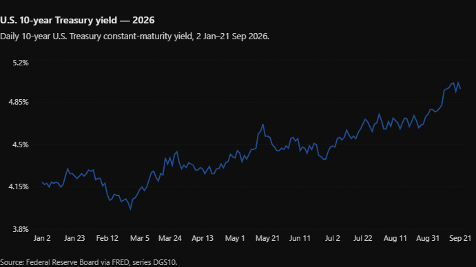

  <header class="post-hero">
    
Adam on FIRE · Blog

    <h1 class="post-title">{{ page.title | escape }}</h1>
    
{{ page.date | date: "%Y. %m. %d." }}

  </header>

  <article class="post-body">

I managed to survive the heat, and by September I finally got my enthusiasm for life back as well. The main lesson of the past four months is that, for me, the most important thing is feeling that I am useful.

One thing that helped a lot was appearing at Brain Bar with Dani as speakers in September, where we put on a really enjoyable three-hour programme. We had two panel discussions with Balázs Bognár, the head of the FIRE Hungary group, and Ádám Németh, who develops the <a href="https://www.growy.hu/">Growy.hu portfolio tracker</a>. I will probably write another blog post about Growy, because I am very happy with the app. It has become one of my favourites, and lately I have also been using it for my FIRE modelling.

The reason I have been checking the markets more often is what has been happening in the bond market. The US 10-year yield has been above 5% since early September, and who knows where it will end. About a year ago, I bought a 7–10-year US Treasury ETF when yields were around 4.2%, and so far I am down 9% on it. That in itself is not really a problem. The bigger issue is that a Trump-style administration will choose inflation over recession anyway – in other words, it will try to inflate away the debt – and in that case a 5% yield is not actually that high, especially if inflation really gets there. Fortunately, the new Fed chair, Kevin Warsh, remains committed to curbing inflation for now, so there was a rate hike this week. But the expectations from the beginning of the year – that rates would fall to 3–3.5% – now look more like wishful thinking, with the US policy rate more likely to stabilize somewhere between 4% and 5%.

And if higher interest rates really do stay with us for a prolonged period, the stock market could run into trouble as well. Everything is still near all-time highs: the S&P 500 is above 7,700, the Nasdaq-1000 is above 30,000 points (and I was already writing at 21,000 that “this is a little high”), AI investment amounts to 2–3% of US GDP, and so on. As an investor, it is fascinating to see how fragile the market’s position appears to be, while it nevertheless continues to rise.

Another positive, from the perspective of my own portfolio, is that I created a new visualization that I will use for my year-end review. It essentially shows how much return I earned from the different components of my portfolio. For now, the September result is slightly below my return target for this year – 8–8.5% – but equities have still performed nicely, while bonds and the other asset classes have contributed less.

But there are still three months left, the midterm elections are coming, and perhaps we will see another major autumn rally this year, just as we did after Trump’s victory in 2024. This time, though, I am not sure how the market would react to a Democratic victory (at the moment, the odds are almost 50–50 that the Democrats will win the Senate as well), and I am concerned that the dollar would weaken in that scenario. Still, it would be important for Trump and the Republican Party to receive a setback, because what they are doing with US debt financing is unlikely to end well over the longer term.

So, go Democrats. On November 3, we will find out which direction the US economy takes next.

  </article>

  

    <a href="/blog">
      ←&nbsp;&nbsp; Back to all posts
      Blog
    </a>
  

