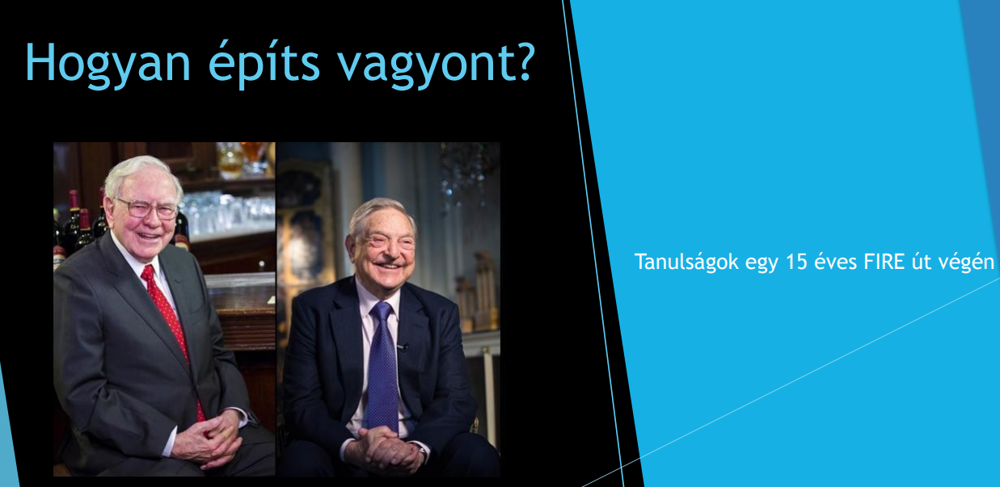
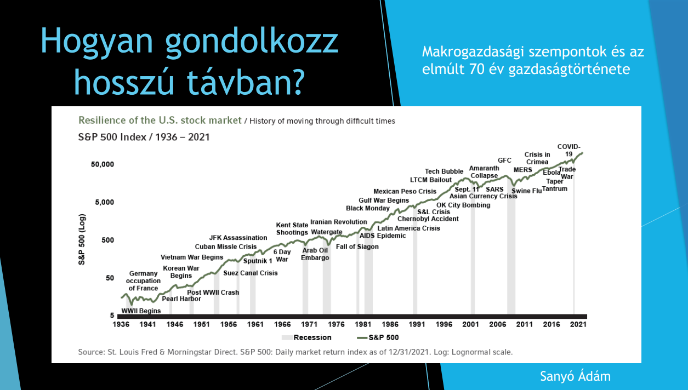

  
Adam on FIRE

  <h1>{{ page.title | escape }}</h1>
  
Useful links, calculators, presentations, and videos that can help you plan your own FIRE journey and manage your finances more consciously.

  <!-- TBSZ AND PORTFOLIO -->
  

    <h4 style="margin-bottom: 25px;">TBSZ and portfolio management</h4>

    

      

        <a href="tbsz" style="color: inherit;">
          

            

              
                <strong>Long-Term Investment Account (TBSZ)</strong>
              
              

                Tax optimization in Hungary – information about the Long-Term
                Investment Account (TBSZ).
              

            

            

              Learn more →
            

          

        </a>
      

      

        <a href="https://docs.google.com/spreadsheets/d/1bqick4Vy13FZMrMZ44g9YiPqF8-Wobd7CH5pAhfl2Bc/copy"
           target="_blank"
           style="color: inherit;">
          

            

              
                <strong>Tracking portfolio performance</strong>
              
              

                A simple, semi-automated Google Sheets spreadsheet
                for tracking your investment portfolio.
              

            

            

              Open spreadsheet →
            

          

        </a>
      

    

  

  <!-- CALCULATORS -->
  

    <h4 style="margin-bottom: 25px;">Calculators</h4>

    

      

        <a href="net-worth" style="color: inherit;">
          

            

              
                <strong>Net worth calculator</strong>
              
              

                How wealthy were you in Hungary in 2025?
                Compare your net worth.
              

            

            

              Open calculator →
            

          

        </a>
      

      

        <a href="spending" style="color: inherit;">
          

            

              
                <strong>Personal spending calculator</strong>
              
              

                See how your spending compares with that of an average Hungarian
                household.
              

            

            

              Open calculator →
            

          

        </a>
      

      

        <a href="pension" style="color: inherit;">
          

            

              
                <strong>State pension calculator</strong>
              
              

                Estimate how much your state pension will be
                under the current rules.
              

            

            

              Open calculator →
            

          

        </a>
      

      

        <a href="inflation" style="color: inherit;">
          

            

              
                <strong>Personal inflation calculator</strong>
              
              

                Calculate your personal inflation rate based on the composition
                of your consumer basket.
              

            

            

              Open calculator →
            

          

        </a>
      

    

  

  <!-- PRESENTATIONS AND VIDEOS -->
  

    <h4 style="margin-bottom: 25px;">Presentations and videos</h4>

    

      <!-- Presentation -->
      

        

          

            
          

          

            
              <strong>How to build wealth?</strong>
            

            

              Lessons from the end of a 15-year FIRE journey.
              Presentation – February 2025
            

          

          

            <a href="https://www.slideshare.net/slideshow/hogyan-epits-vagyont-tapasztalatok-egy-15-eves-fire-ut-vegen/276076087"
               target="_blank">
              Open presentation →
            </a>
          

        

      

 

        

          

            
          

          

            
              <strong>How to think long term?</strong>
            

            

              Macroeconomic perspectives based on 70 years of stock-market events
              Presentation – March 2026
            

          

          

            <a href="https://www.slideshare.net/slideshow/hogyan-gondolkozz-hosszu-tavban-makrogazdasagi-szempontok-az-elmult-70-evben/287004907"
               target="_blank">
              Open presentation →
            </a>
          

        

      

      <!-- YouTube video 1 -->
      

        

          

            

              <iframe
                src="https://www.youtube.com/embed/i6TT_x7nPZ4"
                title="10 misconceptions about the FIRE movement"
                style="
                  position: absolute;
                  top: 0;
                  left: 0;
                  width: 100%;
                  height: 100%;
                  border: 0;
                "
                allow="accelerometer; autoplay; clipboard-write; encrypted-media; gyroscope; picture-in-picture; web-share"
                allowfullscreen>
              </iframe>
            

          

          

            
              <strong>10 misconceptions about the FIRE movement</strong>
            

            

              The most common misunderstandings and misconceptions
              about the FIRE movement – September 2025.
            

          

        

      

      <!-- YouTube video 2 -->
      

        

          

            

              <iframe
                src="https://www.youtube.com/embed/M3R2zgmog5U"
                title="What happened in 2025, and what can we expect in 2026?"
                style="
                  position: absolute;
                  top: 0;
                  left: 0;
                  width: 100%;
                  height: 100%;
                  border: 0;
                "
                allow="accelerometer; autoplay; clipboard-write; encrypted-media; gyroscope; picture-in-picture; web-share"
                allowfullscreen>
              </iframe>
            

          

          

            
              <strong>What happened in 2025, and what can we expect in 2026?</strong>
            

            

              A review of the year and an outlook for the year ahead –
              January 2026.
            

          

        

      

    

  

